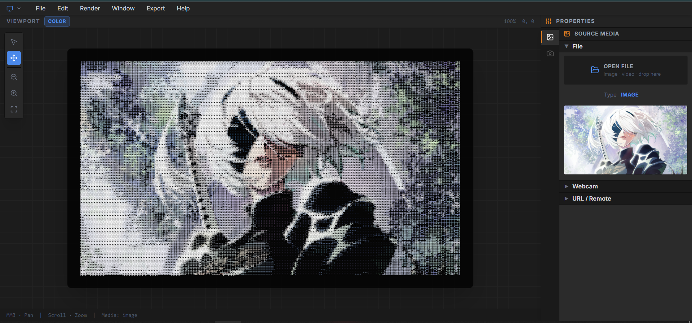
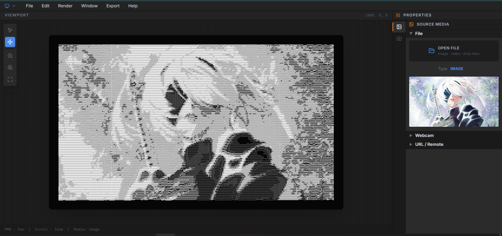
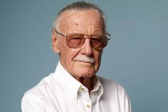
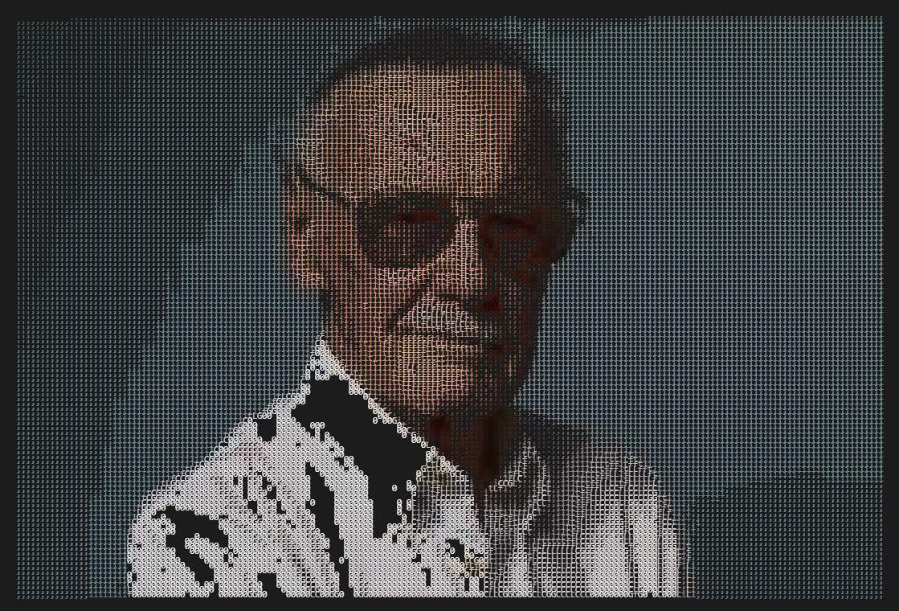

# Art to ASCII


Art to ASCII is a comprehensive media processing platform that translates visual data into complex character-based representations in real-time. By leveraging modern browser capabilities such as WebGL, OffscreenCanvas, and Web Workers, the system provides a high-fidelity conversion environment for static images, dynamic video files, and live camera streams.

---

## Demos & Screenshots

### 🖥️ Dashboard Interface
The application features a professional, Blender-inspired UI designed for distraction-free creative work.


*Real-time color ASCII rendering with intensity controls.*


*Classic grayscale character mapping with high-fidelity luminance tracking.*

### 🖼️ Image Transformation
| Source Media | ASCII Representation |
| :---: | :---: |
|  |  |
| *Original Stan Lee Portrait* | *Character-based Reconstruction* |

### 🎬 Video Transformation
The system supports high-performance video conversion with GPU-accelerated frame processing.

| Source Media (MP4) | ASCII Representation (WebM) |
| :---: | :---: |
| <video src="public/demo/video/cool-dance-anime-naruto-avqklpwrjtzlnbm6.mp4" width="100%" controls loop muted></video> | <video src="public/demo/video/ascii-export.webm" width="100%" controls loop muted></video> |
| *Original Anime Clip* | *Processed ASCII Export* |

---


## Technical Overview

### ASCII Conversion Engine
The core processing logic utilizes a two-stage conversion pipeline:
1.  **Luminance Mapping**: Pixels are converted to grayscale values using industry-standard coefficients (0.334R + 0.333G + 0.333B).
2.  **Character Substitution**: Grayscale values (0-255) are mapped to a predefined character ramp. The system supports custom ramps, allowing for varying levels of visual density.
3.  **Sobel Edge Detection**: Optional spatial filtering using the Sobel operator to highlight structural boundaries within the media, enhancing the legibility of the ASCII output at lower resolutions.

### Advanced Export Pipeline
Unlike standard screen-capture solutions, the export system utilizes a dedicated headless rendering architecture:
-   **WebGL Shaders**: A custom fragment shader processes frames in parallel on the GPU, handling brightness, contrast, inversion, and color blending.
-   **Offscreen Rendering**: High-resolution frames are rendered using `OffscreenCanvas` within a Web Worker to prevent main-thread blocking.
-   **WebM Muxing**: Real-time video encoding using `webm-muxer` and the `VideoEncoder` API, enabling direct-to-disk video generation from ASCII frames.

### Media Management
-   **CORS Proxying**: A backend proxy facilitates the retrieval of remote media assets while bypassing Cross-Origin Resource Sharing (CORS) restrictions.
-   **Cloud Integration**: Background synchronization with Cloudinary for persistent storage of uploaded and processed assets.
-   **Webcam Integration**: Low-latency stream capturing via the MediaDevices API.

---

## Feature Matrix

| Category | Capability | Technical Detail |
| :--- | :--- | :--- |
| **Media Sources** | Images, Video, Webcam | Local file system, Remote URLs, and live hardware streams. |
| **Visual Filters** | Intensity Controls | Real-time adjustment of brightness (0.5x to 2.0x) and contrast. |
| **Rendering** | Modes | Support for monochrome, colored ASCII, and edge-only views. |
| **Customization** | Character Sets | Curated presets (Balanced, Dark, Minimal) plus user-defined ramps. |
| **Interactivity** | Viewport Controls | Hardware-accelerated zooming (0.1x to 5x) and panning. |
| **Workflow** | Video Tools | Integrated timeline with frame seeking and regional trimming. |

---

## Technology Stack

### Core Frameworks


### Graphics & Performance


### Backend & Storage


### Developer Utilities


---

## Architecture Detail

The application follows a modular architecture designed for scalability and separation of concerns:

-   **Frontend Service**: Handles user interactions, state management (via React hooks), and real-time DOM-based ASCII rendering.
-   **API Layer**: Provides server-side logic for media proxying and authenticated uploads to Cloudinary.
-   **Worker Layer**: Offloads computationally expensive tasks (video encoding, high-res frame rendering) to background threads.
-   **Utility Tier**: Contains the core mathematical models for ASCII conversion, edge detection, and media formatting.

---

## Setup & Installation

### Infrastructure Requirements
- Node.js environment (v18 or higher)
- Cloudinary API credentials
- Modern browser with WebGL 2.0 support

### Local Deployment
1.  **Repository Setup**:
    ```bash
    git clone https://github.com/tarunkumar-sys/art_to_ascii.git
    cd art_to_ascii
    ```
2.  **Dependency Resolution**:
    ```bash
    npm install
    ```
3.  **Environment Configuration**:
    Initialize a `.env` file with the following parameters:
    ```env
    CLOUDINARY_CLOUD_NAME=your_cloud_name
    CLOUDINARY_API_KEY=your_api_key
    CLOUDINARY_API_SECRET=your_api_secret
    ```
4.  **Execution**:
    ```bash
    npm run dev
    ```

---

## Contribution Guidelines

The project maintains a high standard for code quality and performance. When contributing, please ensure:
-   Modular component design.
-   Strict adherence to the existing linting rules.
-   Optimization of GPU-intensive code paths.

---

## License

This project is licensed under the MIT License. Details can be found in the LICENSE file within the repository.

---

<div align="center">
  <sub>Engineered for visual excellence by the Open Source Community</sub>
</div>
