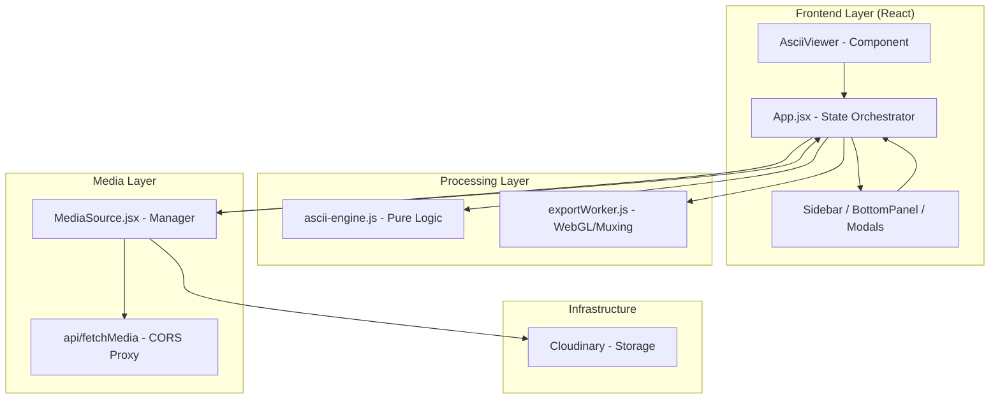
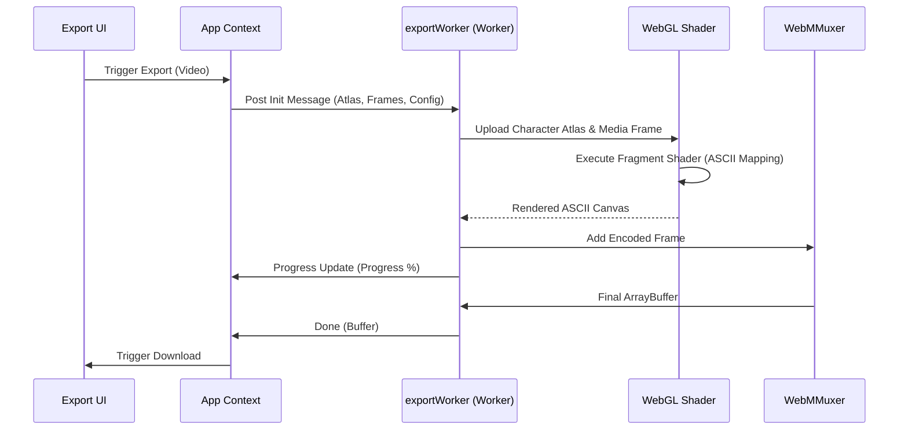

# ASCII Art Application: System Engineering Architecture

This document provides a comprehensive technical specification of the ASCII Art Application, detailing its architectural design, data processing pipelines, and engineering rationale. It is intended for senior engineers, contributors, and maintainers.

---

## 💎 Design Philosophy

The application is engineered with a focus on high-performance, real-time media processing in the browser. Our core design principles include:

1.  **Real-Time Responsiveness**: UI interactions and media processing must occur with minimal latency (<16ms per frame where possible).
2.  **Modular Rendering**: Rendering logic is decoupled from state management, allowing for plugin-style extensions.
3.  **Non-Blocking Interaction**: Heavy computations (exports, complex filtering) are delegated to background threads (Web Workers).
4.  **GPU-Assisted Processing**: Leveraging the GPU for high-resolution exports and complex visual transformations.
5.  **Scalability & Maintainability**: A centralized state model paired with immutable configuration bundles for predictable behavior.

---

## 🏛 Architecture Overview

The system follows a **Flux-inspired Centralized State** architecture with a **Push-based Processing Pipeline**.

### High-Level Component Architecture



---

## 🔄 Data Flow Pipelines

### 1. Real-Time Rendering Pipeline (Pull Model)
This pipeline is optimized for zero-latency preview rendering.

1.  **Trigger**: `requestAnimationFrame` fires at the display's refresh rate.
2.  **Sampling**: The hidden `<video>` or `` element in `MediaSource.jsx` provides the current frame.
3.  **Downscaling**: The frame is drawn onto a low-resolution hidden canvas to match the ASCII resolution.
4.  **Extraction**: `getImageData()` extracts the pixel buffer.
5.  **Transformation**: `ascii-engine.js` applies filters (brightness, contrast, edge detection) and maps luminance to ASCII characters.
6.  **Injection**: The resulting string/HTML is injected into the `AsciiViewer`'s DOM.

### 2. GPU-Accelerated Export Pipeline (Push Model)
Designed for high-fidelity output without impacting UI performance.



---

## 📁 Project Directory Structure

```text
ascii-app/
├── api/                    # Vercel-style Serverless API Routes
│   ├── fetchMedia.js       # CORS proxy and media extractor (Cobalt integration)
│   ├── uploadMedia.js      # Cloudinary upload handler (multipart/base64/URL)
│   └── gifWorker.js        # Proxy for gif.js worker to bypass origin limits
├── src/                    # Main Application Source
│   ├── assets/             # Branding and static UI assets
│   ├── components/         # React Functional Components
│   │   ├── AsciiViewer.jsx     # High-performance viewport (SVG/Text/Pan-Zoom)
│   │   ├── Sidebar.jsx        # Unified configuration sidebar
│   │   ├── BottomPanel.jsx    # Timeline and playback orchestration
│   │   ├── MediaSource.jsx     # Imperative media state manager
│   │   ├── ExportDropdown.jsx  # Export orchestration logic
│   │   ├── Layout.jsx          # Dashboard grid and layout providers
│   │   └── ...                 # Modals, Dropdowns, and UI primitives
│   ├── utils/              # Pure Logic & Utility Functions
│   │   ├── ascii-engine.js    # Computational core (Luminance, Sobel, Mapping)
│   │   └── media-fetcher.js   # Client-side media resolution and Blob handling
│   ├── workers/            # Web Workers for Non-blocking Tasks
│   │   └── exportWorker.js    # WebGL-accelerated export unit
│   ├── App.jsx             # Main Application Logic & Global State
│   ├── main.jsx            # React 19 concurrent mode entry point
│   └── index.css           # Tailwind CSS 4 entry and global design tokens
├── public/                 # Static assets (fonts, workers, icons)
├── eslint.config.js        # Linting and code style configuration
├── package.json            # Dependency manifest and scripts
├── vite.config.js          # Build tool configuration & API proxy setup
└── .env                    # Environment secrets (Cloudinary credentials)
```

## 🧩 Architectural Responsibilities

### Core Frontend (`src/components/`)
- **`Layout.jsx`**: Orchestrates the multi-panel workspace. Implements the responsive grid and manages theme providers.
- **`Sidebar.jsx`**: Central hub for user configuration. Handles complex inputs for resolution, brightness, and character sets.
- **`AsciiViewer.jsx`**: The primary display engine. Uses CSS hardware acceleration for smooth panning and zooming of large text blocks.
- **`BottomPanel.jsx`**: Specialized video control interface. Manages sub-second timeline scrubbing and frame-perfect trim selection.
- **`MediaSource.jsx`**: An imperative interface component. It acts as a bridge between React state and raw HTML5 media elements, managing object URL lifecycles.
- **`ExportDropdown.jsx`**: The gateway to the export pipeline. Prepares character atlases and coordinates with the background worker.

### Computational Layer (`src/utils/`)
- **`ascii-engine.js`**: The project's mathematical heart. Optimized for high-throughput pixel processing using `Uint32Array` for luminance mapping and pre-calculated Sobel kernels.
- **`media-fetcher.js`**: Resolves media from diverse sources (Local, Remote, Social). Implements retry logic and MIME-type validation.

### Background Processing (`src/workers/`)
- **`exportWorker.js`**: A high-performance WebGL environment. It maintains its own internal frame buffer and executes custom GLSL fragment shaders for real-time ASCII synthesis during export.

### Edge Services (`api/`)
- **`fetchMedia.js`**: A security-first proxy. It sanitizes external requests and re-streams content from multiple failover sources to ensure high availability.
- **`uploadMedia.js`**: Integrates with Cloudinary. Supports streaming uploads for large files and base64-encoded exports.

---

## ⚡ Engineering Rationale

| Decision | Rationale |
| :--- | :--- |
| **`requestAnimationFrame`** | Ensures synchronization with the browser's refresh cycle, preventing frame skipping and minimizing layout jitters compared to `setInterval`. |
| **Web Workers** | Encodes videos and processes high-res frames in a separate thread to keep the main UI thread responsive (60fps). |
| **Typed Arrays** | `Float32Array` provides predictable memory layout and near-native performance for pixel manipulation in JS. |
| **WebGL Shaders** | Mapping ASCII characters on the CPU for a 4K video is $O(n^2)$ and slow. Shaders parallelize this across thousands of GPU cores. |
| **Centralized State** | Simplifies the complex synchronization required between the viewer, sidebar, and export modules. |

---

## 🚀 Performance & Optimization

### Identified Bottlenecks
- **DOM Rendering Limits**: Injecting 50k+ `<span>` elements for colored ASCII causes significant layout lag.
- **Per-Pixel Processing**: Iterating over large images in JS is CPU intensive.
- **GPU Upload Overhead**: Constantly uploading 4K frames to the GPU during export can saturate the PCIe bus.

### Optimization Strategies
- **Canvas Downsampling**: We process a "virtual resolution" rather than the raw media resolution to keep the character count manageable.
- **Fragment Shader Mapping**: For exports, we use a **Character Atlas** texture. The shader calculates the character UV offset in a single pass, moving the entire mapping logic to the GPU.
- **Frame Syncing**: Video frame extraction is gated by the video element's `requestVideoFrameCallback` where supported, reducing redundant processing.

---

## 🎨 Rendering Modes & Extensibility

The system supports multiple rendering pipelines, each optimized for different visual outcomes and performance profiles.

### 1. Plain Text Mode
- **Mechanism**: Maps luminance to a 1D character ramp.
- **Performance**: Extremely fast. Renders into a single `<pre>` tag.
- **Best for**: Large resolutions and low-latency previews.

### 2. Colored ASCII (HTML)
- **Mechanism**: Wraps each character in a `<span>` with inline `color: rgb(...)` styles.
- **Bottleneck**: High DOM node count. Optimized by reducing character resolution.
- **Architecture**: The `ascii-engine` generates an array of strings which is then joined with newlines for the final output.

### 3. Edge Detection Mode
- **Algorithm**: **Sobel Operator**.
- **Process**: Calculates the gradient intensity at each pixel. Instead of luminance, the gradient value is mapped to the character ramp, effectively drawing "outlines."
- **Use Case**: Artistic "blueprint" or "sketch" effects.

### 4. Future Rendering Extensions
The `renderOpts` bundle is designed for extensibility:
- **Matrix Mode**: Injecting "falling" character logic into the character mapping phase.
- **Dithering**: Adding Floyd-Steinberg or Ordered Dithering before the character mapping to simulate higher depth with fewer characters.

---

## 🛡 Security & Error Handling

### Error Handling & Recovery
- **Invalid Media**: `MediaSource` validates MIME types before loading. Fallback to "No Media" state if loading fails.
- **CORS Failures**: Handled via the `/api/fetchMedia` proxy which re-streams content from a safe origin.
- **Worker Crashes**: Workers are wrapped in try-catch blocks; if a worker fails, the UI resets the export state and notifies the user.
- **Cleanup Logic**: `useEffect` hooks in components handle `URL.revokeObjectURL` and webcam track termination to prevent memory leaks and privacy issues.

### Security Considerations
- **Backend Proxying**: Protects the client from direct exposure to potentially malicious third-party trackers on media hosts.
- **Credential Protection**: Cloudinary API keys are stored server-side; the client only interacts with the application's own API.
- **Input Sanitization**: ASCII characters are sanitized before being injected into the DOM to prevent XSS (though the app primarily uses text nodes).

---

## 🔌 API Contract

### `GET /api/fetchMedia?url=<target>`
- **Purpose**: CORS Proxy and Social Media Extractor.
- **Success**: Returns the raw media stream with `Access-Control-Allow-Origin: *`.
- **Failure**: Returns 400 (Missing URL), 415 (Invalid Type), or 500 (Extraction Failure).

### `POST /api/uploadMedia`
- **Purpose**: Background backup of media to Cloudinary.
- **Payload**: `multipart/form-data` containing a `file` or `base64` string.
- **Success**: `{ success: true, url: "...", public_id: "..." }`.

---

## 🛣 Future Roadmap

- **WASM Processing**: Port the `ascii-engine` to Rust/WASM to leverage SIMD instructions for 2-3x faster CPU processing.
- **Plugin Architecture**: Allow developers to register custom `RenderPipeline` classes for different styles (e.g., Matrix effect, Braille art).
- **Advanced Filters**: Implement Canny edge detection and Kuwahara smoothing filters.
- **ANSI Terminal Export**: Support exporting direct ANSI-coded text files for CLI enthusiasts.

---

## 🧪 Testing Strategy

- **Unit Testing**: Vitest for `ascii-engine.js` logic (validating grayscale accuracy).
- **Snapshot Testing**: Ensuring consistent ASCII output for fixed test images.
- **Integration Testing**: Playwright for end-to-end export pipeline validation.
- **Performance Benchmarking**: Automated tracking of "Time to First ASCII Frame" and "Export Frames Per Second".

---
*Documentation Version: 1.0.0*
